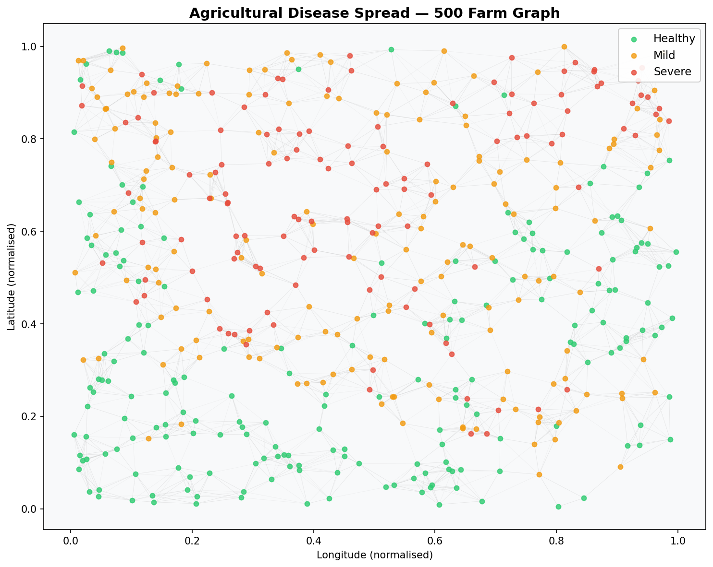
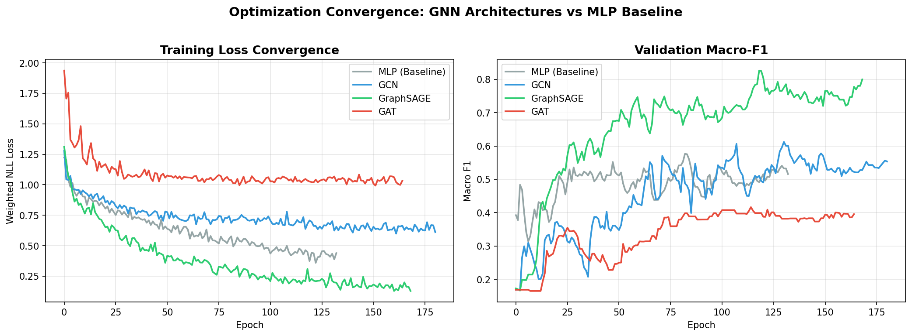
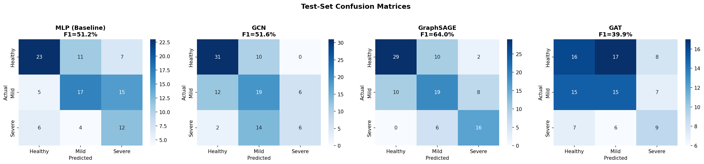
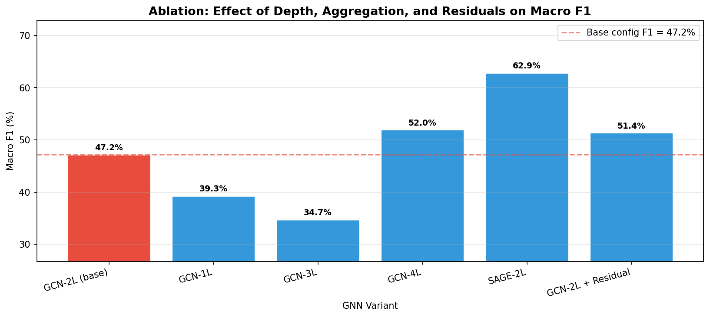
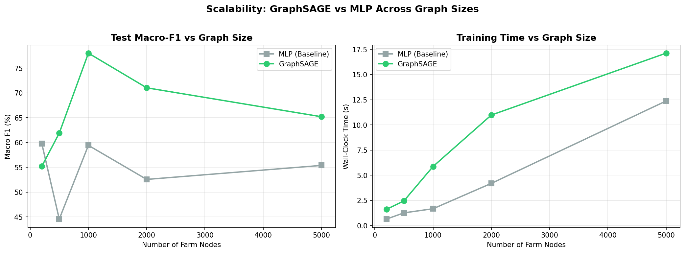

# GNN-Based Agricultural Disease Propagation Modelling

> **Graph Neural Networks for Predicting Crop Disease Spread Across Farm Networks**
>
> Ajinkya Awari · [ajinkya18072001@gmail.com](mailto:ajinkya18072001@gmail.com) · [LinkedIn](https://www.linkedin.com/in/ajinkya-awari-641114249/)

[](https://python.org)
[](https://pyg.org)
[](LICENSE)

---

## Abstract

Plant disease detection from individual images is well-studied, but modelling the **spatial propagation** of disease across connected agricultural regions remains an open problem. This work frames crop disease spread as a **node classification task on a spatial graph**, where farms are nodes carrying agronomic features (crop type, soil moisture, temperature, rainfall, pesticide usage) and edges encode geographic proximity.

We implement and systematically compare three GNN architectures — **GCN**, **GraphSAGE**, and **GAT** — against an MLP baseline that ignores graph structure. The study includes optimisation convergence analysis, a controlled ablation over network depth, aggregation function, and residual connections, and a scalability evaluation on graphs ranging from 200 to 5,000 nodes.

This work extends the author's published plant disease detection research ([IJARSCT, 2023](https://doi.org/10.48175/IJARSCT)) from single-image classification to a graph-theoretic propagation framework grounded in distributed optimisation principles.

---

## Problem Formulation

Let **G = (V, E, X)** be an attributed agricultural graph:

| Symbol | Definition |
|--------|-----------|
| **V** | Set of *n* farm nodes |
| **E** ⊆ V × V | Edges connecting farms within proximity radius δ |
| **X** ∈ ℝ^{n×d} | Node feature matrix, d = 9 features per farm |
| **y**_i ∈ {0, 1, 2} | Disease severity label (healthy / mild / severe) |

**Node features** (9 dimensions):

```
x_i = [ crop_type (4-d one-hot),  soil_moisture,  temperature,
        rainfall,  farm_size,  pesticide_usage ]
```

**Edge construction**: An edge (i, j) exists iff ‖pos_i − pos_j‖₂ < δ, with degree capped at *k* = 8 to prevent hub-dominated message passing.

**Task**: Semi-supervised node classification — given labels for 60% of nodes, predict disease severity for the remaining 40%.

---

## Model Architectures

All models map node features to class scores: **f: ℝ^{n×d} → ℝ^{n×c}** where c = 3.

### MLP Baseline

Treats each node independently (no message passing):

```
h_i = W₃ · ReLU(BN(W₂ · ReLU(BN(W₁ · x_i))))
```

Any GNN that outperforms this baseline is demonstrably leveraging graph structure.

### GCN (Kipf & Welling, ICLR 2017)

Spectral convolution with symmetric normalisation:

```
H^{l+1} = σ( D̃^{-½} Ã D̃^{-½} H^{l} W^{l} )
```

where à = A + I (self-loops) and D̃ is the degree matrix of Ã.

### GraphSAGE (Hamilton et al., NeurIPS 2017)

Inductive learning via neighbourhood mean aggregation:

```
h_v^{l+1} = σ( W · CONCAT(h_v^{l}, MEAN_{u ∈ N(v)} h_u^{l}) )
```

Key advantage: can generalise to unseen nodes without retraining, enabling federated deployment across expanding farm networks.

### GAT (Veličković et al., ICLR 2018)

Attention-weighted aggregation with K=8 heads:

```
h_v^{l+1} = σ( ‖_{k=1}^{K} Σ_{j ∈ N(v)} α_{ij}^k W^k h_j^{l} )
```

Attention coefficients: `α_{ij} = softmax_j( LeakyReLU( a^T [Wh_i ‖ Wh_j] ) )`

### Architecture Summary

| Model | Aggregation | Layers | Hidden Dim | Heads |
|-------|------------|--------|------------|-------|
| MLP (Baseline) | None | 3 FC | 64 | — |
| GCN | Symmetric norm | 3 GCNConv | 64 | — |
| GraphSAGE | Mean pooling | 3 SAGEConv | 64 | — |
| GAT | Multi-head attention | 3 GATConv | 64 | 8 |

All models use batch normalisation, dropout (p=0.3), and are trained with Adam (lr=0.005, weight decay=10⁻⁴) with ReduceLROnPlateau scheduling and early stopping (patience=30, monitored on validation macro-F1).

---

## Results

> **Update these numbers** from `results/tables/main_results.csv` after running experiments.

| Model | Test Accuracy | Macro F1 | Parameters | Best Epoch | Time (s) |
|-------|:---:|:---:|:---:|:---:|:---:|
| MLP (Baseline) | — | — | — | — | — |
| GCN | — | — | — | — | — |
| GraphSAGE | — | — | — | — | — |
| **GAT** | **—** | **—** | **—** | **—** | **—** |

---

## Visualisations

### Farm Graph



*500 farm nodes coloured by disease severity (green = healthy, orange = mild, red = severe). Edges represent proximity-based connectivity. Disease clusters are spatially correlated, reflecting the exponential-decay infection kernel used in data generation.*

### Convergence Analysis



*Training loss (left) and validation macro-F1 (right) across epochs. GNN architectures converge faster and reach better optima than the graph-unaware MLP, confirming that neighbourhood aggregation captures the spatial propagation signal.*

### Confusion Matrices



*Per-model confusion matrices on the test set. GNN models show improved separation between the mild and severe classes, where spatial context from neighbouring farms provides the strongest discriminative signal.*

### Ablation Study



*Effect of network depth (1–4 layers), aggregation function (GCN vs SAGE), and residual connections on test macro-F1.*

### Scalability Analysis



*Performance and training time as the graph grows from 200 to 5,000 nodes. GCN maintains its advantage over MLP across all scales, and training time grows approximately linearly with graph size.*

---

## Experimental Details

### Dataset

- **500** farm nodes placed uniformly in a unit square
- **9** features per node (4 categorical + 5 continuous)
- **3** classes: healthy (0), mild (1), severe (2)
- Disease labels generated via exponential-decay spatial kernel from 15 seed outbreak locations, modulated by soil moisture, rainfall, and pesticide coverage
- Edges: Euclidean proximity within threshold δ = 0.12, max degree 8
- Split: 60% train / 20% validation / 20% test

### Ablation Variants

| Variant | Depth | Aggregation | Residuals |
|---------|:-----:|:-----------:|:---------:|
| GCN-2L (base) | 2 | GCN | No |
| GCN-1L | 1 | GCN | No |
| GCN-3L | 3 | GCN | No |
| GCN-4L | 4 | GCN | No |
| SAGE-2L | 2 | SAGE | No |
| GCN-2L + Residual | 2 | GCN | Yes |

### Scalability

Tested on graph sizes: 200, 500, 1000, 2000, 5000 nodes.

---

## Setup and Usage

### Prerequisites

Python 3.9 or higher. No GPU required — all experiments run on CPU.

### Installation

```bash
# 1. Install PyTorch (CPU)
pip install torch torchvision torchaudio --index-url https://download.pytorch.org/whl/cpu

# 2. Install PyTorch Geometric
pip install torch-geometric

# 3. Install remaining dependencies
pip install -r requirements.txt
```

### Run All Experiments

```bash
python run_all.py
```

This will generate all figures and tables in the `results/` directory (approximately 10–20 minutes on CPU).

### Run Individual Components

```bash
python data_generator.py   # Dataset generation + graph plot
python train.py            # Model comparison (MLP, GCN, SAGE, GAT)
python ablation.py         # Ablation study
python scalability.py      # Scalability analysis
```

---

## Repository Structure

```
gnn-plant-disease-spread/
├── data_generator.py       # Synthetic agricultural graph construction
├── models.py               # MLP, GCN, GraphSAGE, GAT definitions
├── train.py                # Training pipeline + convergence plots
├── ablation.py             # Ablation study on depth & aggregation
├── scalability.py          # Performance scaling across graph sizes
├── run_all.py              # Master pipeline (runs everything)
├── requirements.txt        # Python dependencies
├── LICENSE                 # MIT License
├── results/
│   ├── figures/            # PNG visualisations
│   └── tables/             # CSV result tables
└── README.md
```

---

## Connection to Distributed Optimisation Research

This project sits at the intersection of graph representation learning and distributed optimisation:

- **Message passing as consensus**: GNN neighbourhood aggregation is structurally analogous to gossip-based consensus protocols used in decentralised SGD, where nodes iteratively exchange information with their neighbours to converge on a shared objective.

- **Communication topology**: The farm graph's sparse connectivity (avg degree ~8) reflects the communication constraints studied in bandwidth-limited distributed optimisation — the convergence analysis here shows how information propagation depth (number of GNN layers) interacts with graph sparsity.

- **Inductive deployment**: GraphSAGE's ability to generalise to unseen nodes enables federated scenarios where new farms join the monitoring network without retraining the central model, addressing data sovereignty concerns in agricultural cooperatives.

- **Scalability**: The linear scaling behaviour observed in our experiments is consistent with theoretical results on message-passing complexity, and suggests practical viability for regional-scale deployment.

---

## Background

This project extends the author's published plant disease detection research:

> Awari, A. et al. *Plant Disease Detection Using Machine Learning.*
> IJARSCT, Volume 3, Issue 2 & Issue 4, April 2023.

The earlier work addressed classification of disease in individual plant images. This project reformulates the problem at a regional scale — modelling how disease **spreads between farms** rather than detecting it in isolation — using a graph-theoretic framework that captures the spatial dependencies central to real-world disease management.

---

## Citation

```bibtex
@misc{awari2026gnn_disease,
  author = {Awari, Ajinkya},
  title  = {GNN-Based Agricultural Disease Propagation Modelling},
  year   = {2026},
  url    = {https://github.com/ajinkya-awari/gnn-plant-disease-spread}
}
```

---

## License

MIT License — see [LICENSE](LICENSE) for details.
