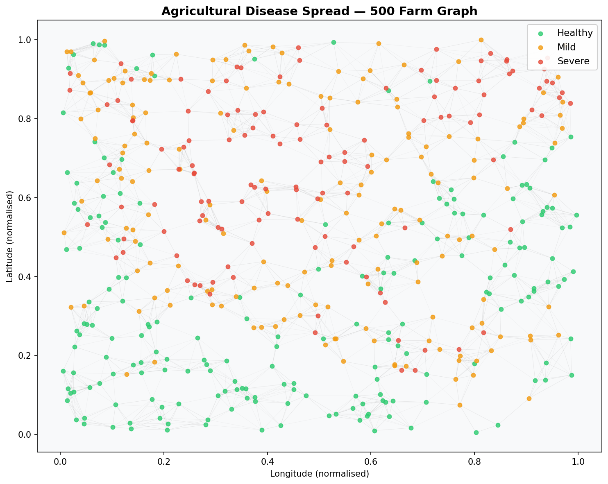
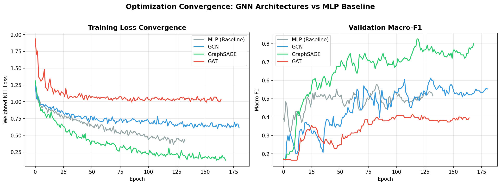
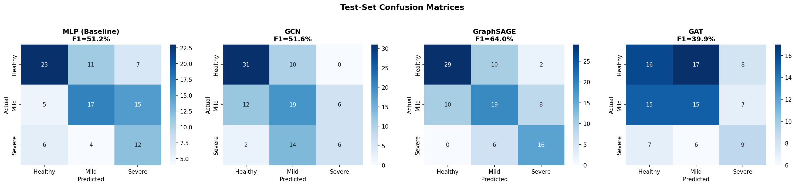
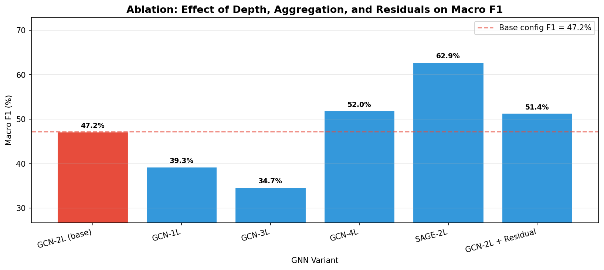
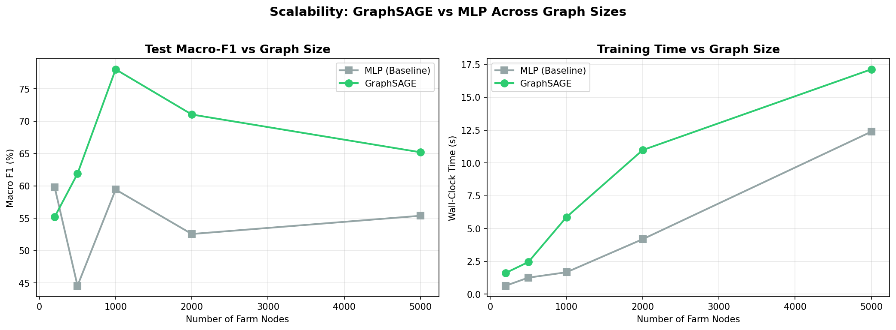

# When Does Graph Structure Help? An Empirical Study of GNN Architectures for Agricultural Disease Propagation

> Ajinkya Awari · [ajinkya18072001@gmail.com](mailto:ajinkya18072001@gmail.com) · [LinkedIn](https://www.linkedin.com/in/ajinkya-awari-641114249/)

[](https://python.org)
[](https://pyg.org)
[](LICENSE)

---

## Motivation

Standard plant disease detection treats each crop image as an independent observation. But in practice, disease spreads. A diseased farm does not exist in isolation — it shares water sources, wind corridors, and proximity with its neighbours. Ignoring those connections discards the most diagnostic signal about who gets infected next.

This project asks a more fundamental question than "can a GNN classify disease severity?":

> **Under what conditions does modelling the graph structure of a farm network actually improve predictions — and when does it not?**

This matters beyond agriculture. It is a concrete instance of a general open problem in graph representation learning: *how do architectural assumptions about neighbourhood aggregation interact with the actual topology of the data?* The same question arises in molecular property prediction, social network analysis, and any setting where the graph is sparse, noisy, or heterogeneous.

A secondary motivation comes from the connection to distributed optimisation. GNN message-passing and gossip-based consensus protocols in decentralised SGD share the same mathematical structure — iterative neighbourhood aggregation over a sparse communication graph. Understanding how aggregation depth and topology affect GNN convergence is therefore relevant to understanding distributed learning more broadly.

---

## Research Questions

This study was designed around four concrete questions:

1. **Does neighbourhood structure carry predictive signal?**
   Is the spatial connectivity of farms informative for disease prediction, or does a graph-unaware MLP achieve competitive performance using only node features?

2. **How does the choice of aggregation function affect what gets learned?**
   GCN uses symmetric spectral normalisation; GraphSAGE uses mean concatenation; GAT uses learned attention weights. Do these architectural choices produce meaningfully different outcomes on the same graph topology?

3. **Where does deeper aggregation help — and where does it hurt?**
   Stacking more GNN layers expands the receptive field, allowing each node to incorporate information from farther neighbours. But repeated averaging is known to cause over-smoothing. Where is the crossover point on this graph?

4. **Does the performance advantage of GNNs grow or shrink as the graph scales?**
   At small graph sizes, neighbourhood information may be insufficient. At large sizes, long-range dependencies may dominate. We trace how the gap between graph-based and graph-unaware models evolves from 200 to 5,000 nodes.

---

## Methodology

### Graph Construction

We generate a synthetic agricultural graph with realistic spatial structure. Farms are placed at random 2D coordinates; an edge connects two farms when their Euclidean distance falls below a proximity threshold δ, with degree capped at *k* = 8 to prevent unrealistically high-degree hub nodes. This produces a sparse graph with average degree ≈ 8, comparable to real agricultural adjacency networks.

**Node features** (9 dimensions per farm):

```
x_i = [ crop_type (4-d one-hot),  soil_moisture,  temperature,
        rainfall,  farm_size,  pesticide_usage ]
```

Disease labels (healthy / mild / severe) are generated by simulating exponential-decay spread from randomly placed infection seeds, modulated by soil moisture, rainfall, and pesticide usage. This produces spatially correlated label distributions, where the graph connectivity is genuinely informative for prediction.

**Task**: Semi-supervised node classification — 60% training, 20% validation, 20% test.

### Models

All models map node features to class scores **f: ℝⁿˣᵈ → ℝⁿˣ³**.

| Model | Aggregation | Key Equation |
|---|---|---|
| **MLP (Baseline)** | None | h = W₃ · ReLU(W₂ · ReLU(W₁ · x)) |
| **GCN** | Spectral normalisation | H' = σ(D̃⁻½ Ã D̃⁻½ H W) |
| **GraphSAGE** | Mean concatenation | h_v = σ(W · CONCAT(h_v, MEAN_{u∈N(v)} h_u)) |
| **GAT** | Learned attention (K=4 heads) | h_v = σ(‖ₖ Σⱼ αᵢⱼᵏ Wᵏ hⱼ) |

All models use batch normalisation, dropout (p=0.5), Adam optimiser (lr=0.01, weight decay=5×10⁻⁴), class-weighted NLL loss, ReduceLROnPlateau scheduling, and early stopping monitored on validation macro-F1 (patience=50). Evaluation uses macro-averaged F1 because the three disease classes are moderately imbalanced.

### Ablation Design

To isolate the effect of architectural choices, we run controlled variants of GCN:
- **Depth**: 1, 2, 3, and 4 GNN layers (holding all else constant)
- **Aggregation**: GCN symmetric norm vs. GraphSAGE mean aggregation (at equal depth)
- **Residual connections**: skip-connections from input to output of each layer

### Scalability Protocol

We generate graphs of 200, 500, 1,000, 2,000, and 5,000 nodes using the same construction procedure, then compare MLP and GraphSAGE at each scale.

---

## Key Findings

### 1. Graph structure is informative — but only at sufficient scale

GraphSAGE achieves **64.0% macro-F1** against the MLP baseline's **51.2%**, a **+12.8 point improvement** at 500 nodes. But at 200 nodes, GraphSAGE (55.2%) is actually *worse* than MLP (59.8%). The graph-based advantage emerges and widens as the graph grows, peaking at +18.6 points at 1,000 nodes.

This suggests a phase transition: at small graph sizes, the disease signal from neighbourhood aggregation is too noisy to improve on node-feature-only predictions. Once the graph is large enough that spatial clustering becomes statistically reliable, aggregation provides a substantial lift.

| Graph Size | MLP F1 | GraphSAGE F1 | Δ F1 |
|---|:---:|:---:|:---:|
| 200 | 59.8% | 55.2% | −4.6 |
| 500 | 44.6% | 61.9% | +17.3 |
| 1,000 | 59.4% | **78.0%** | **+18.6** |
| 2,000 | 52.6% | 71.0% | +18.5 |
| 5,000 | 55.4% | 65.2% | +9.8 |

### 2. Aggregation function matters more than depth

The ablation study reveals a striking asymmetry: at equal depth (2 layers), **SAGE aggregation outperforms GCN spectral normalisation by +15.7 F1 points** (62.9% vs. 47.2%). This gap is larger than the effect of any other design choice tested. The inductive bias of concatenation-based aggregation — which preserves the central node's identity while incorporating neighbourhood information — appears better suited to this sparse, spatially structured graph than the spectral smoothing used by GCN.

### 3. Over-smoothing is visible and abrupt

GCN with 3 layers collapses to **34.7% F1**, down from 47.2% at 2 layers — a loss of 12.5 points in a single additional layer. On a sparse graph with average degree 8, 3 hops of averaging appears sufficient to wash out the distinguishing features between healthy and diseased nodes. Residual connections partially recover from this (+4.2 points at 2 layers), but do not prevent the collapse at 3.

| Variant | Test F1 |
|---|:---:|
| GCN-1L | 39.3% |
| GCN-2L | 47.2% |
| **GCN-3L** | **34.7%** ← over-smoothing |
| GCN-4L | 52.0% |
| SAGE-2L | **62.9%** |
| GCN-2L + Residual | 51.4% |

### 4. GAT underperforms on uniform-degree graphs

GAT achieves only **39.9% F1**, below even the MLP baseline. This is consistent with the theoretical expectation that attention mechanisms provide the most benefit when nodes have meaningfully heterogeneous neighbour relevance. On this graph, where degree is capped at 8 and edges reflect purely geometric proximity, there is little structure for the attention mechanism to exploit. The uniform topology provides no signal about which neighbours matter more.

This is a useful negative result: **attention does not always help, and the benefit depends on the graph topology, not just the task.**

---

## Visual Results

### Disease Spread Graph

*500 farm nodes coloured by disease severity. Spatial clustering is visible: diseased nodes tend to concentrate in connected regions, which is precisely the signal that neighbourhood aggregation is designed to capture.*

### Convergence Analysis

*Training loss and validation F1 across epochs. GraphSAGE converges to a substantially higher optimum than GCN, which in turn only marginally outperforms the graph-unaware MLP. The convergence curves reveal that GCN and MLP reach similar loss values but from different trajectories — suggesting that GCN's spectral smoothing may be suppressing useful heterogeneity in the node representations.*

### Confusion Matrices

*GraphSAGE achieves the most balanced performance across all three disease classes. GCN and MLP both show a tendency to over-predict the "healthy" class, consistent with a model that is underusing neighbourhood information.*

### Ablation Study

*The abrupt drop at GCN-3L is the most salient result: a single extra layer causes a larger performance loss than switching from no graph structure to full GCN. The SAGE column confirms that aggregation function choice dominates depth choice.*

### Scalability Analysis

*The MLP baseline fluctuates around 50–60% F1 regardless of graph size, as expected for a model that uses only local features. GraphSAGE's advantage grows monotonically up to 1,000 nodes, then begins to shrink at 5,000 — potentially because long-range dependencies begin to dilute the local disease signal.*

---

## Future Work

Several natural extensions follow from the findings above:

**1. Heterophilic graph variants.** The current graph is homophilic: farms with the same disease status tend to be connected. Testing these architectures on adversarially constructed heterophilic graphs — where disease does not cluster spatially — would reveal whether the observed advantage is topology-dependent or robust.

**2. Dynamic graphs.** Disease spread is a temporal process. Extending the framework to temporal GNNs (e.g. T-GCN or EvolveGCN) would enable modelling of how the disease distribution evolves over discrete time steps, which is closer to the real deployment scenario.

**3. Communication-constrained aggregation.** The connection to distributed SGD suggests a natural experiment: what happens if each node can only exchange messages with a strict bandwidth budget? Studying GNN performance under edge subsampling would connect these results directly to the literature on communication-efficient distributed optimisation.

**4. Real agricultural graph data.** The synthetic graph assumes geometric proximity as the sole connectivity criterion. Incorporating directed edges reflecting wind direction, elevation gradients, or shared water sources would test whether the performance patterns observed here persist on realistic topology.

**5. Attention mechanism analysis.** GAT's poor performance is worth investigating further. Examining whether the learned attention weights exhibit meaningful spatial patterns — or collapse to near-uniform weights — would clarify whether the mechanism is failing to find signal or finding it and still underperforming.

---

## Setup and Usage

No GPU required. All experiments run on CPU in approximately 5–15 minutes.

```bash
# 1. Install PyTorch (CPU)
pip install torch torchvision torchaudio --index-url https://download.pytorch.org/whl/cpu

# 2. Install PyTorch Geometric
pip install torch-geometric

# 3. Install remaining dependencies
pip install -r requirements.txt

# 4. Run all experiments
python run_all.py
```

Individual components:

```bash
python data_generator.py   # graph construction and visualisation
python train.py            # model comparison (MLP, GCN, SAGE, GAT)
python ablation.py         # ablation study
python scalability.py      # scalability analysis across graph sizes
```

---

## Repository Structure

```
gnn-agricultural-networks/
├── data_generator.py       # Graph construction with controllable topology
├── models.py               # MLP, GCN, GraphSAGE, GAT implementations
├── train.py                # Training pipeline + convergence analysis
├── ablation.py             # Depth, aggregation, and residual ablation
├── scalability.py          # Performance scaling 200 → 5,000 nodes
├── run_all.py              # Master pipeline
├── requirements.txt
├── LICENSE
├── results/
│   ├── figures/
│   └── tables/
└── README.md
```

---

## Background

This project extends the author's published work on plant disease detection:

> Awari, A. et al. *Plant Disease Detection Using Machine Learning.*
> IJARSCT, Volume 3, Issue 2 & Issue 4, April 2023.

The earlier work framed disease as an image classification problem on individual plants. This project reframes it as a network propagation problem, where the structure of connectivity between farms is itself a source of predictive signal. The shift from per-instance classification to relational graph reasoning changes both the modelling approach and the types of failure modes that are interesting to study.

---

## Citation

```bibtex
@misc{awari2026gnn_disease,
  author = {Awari, Ajinkya},
  title  = {When Does Graph Structure Help? GNN Architectures for Agricultural Disease Propagation},
  year   = {2026},
  url    = {https://github.com/ajinkya-awari/gnn-agricultural-networks}
}
```

---

*MIT License — see [LICENSE](LICENSE) for details.*
